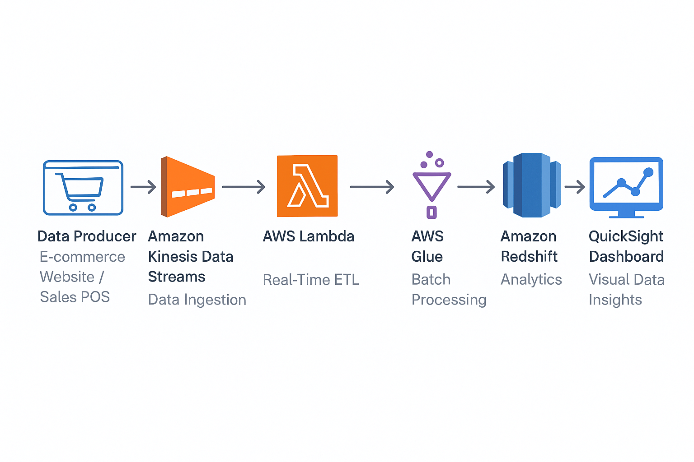
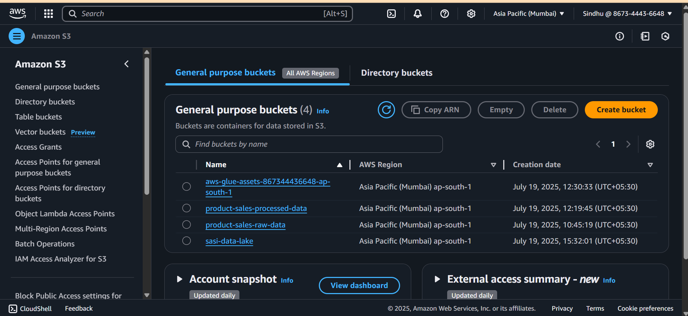
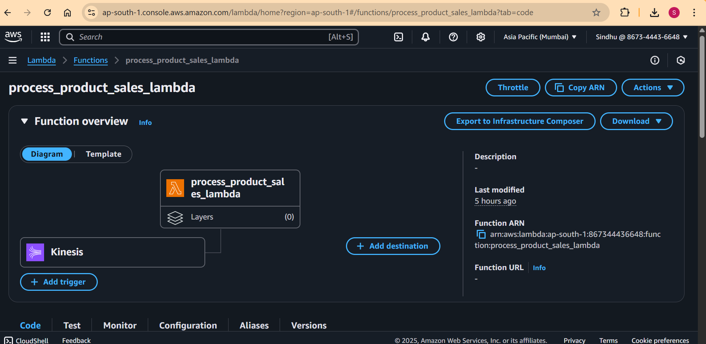
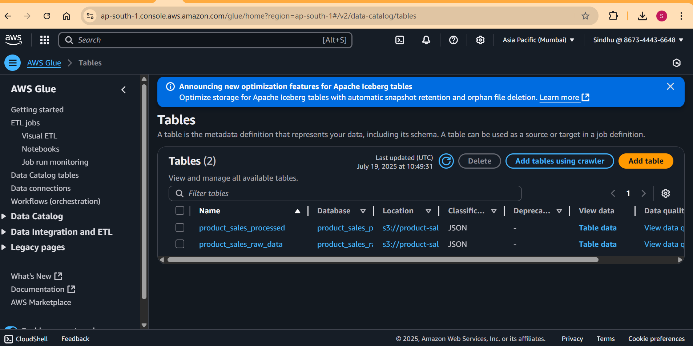
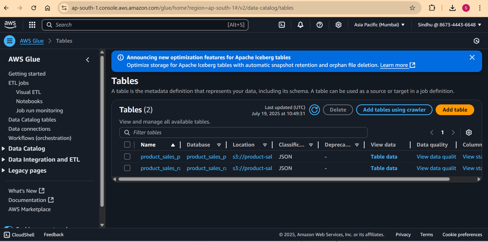
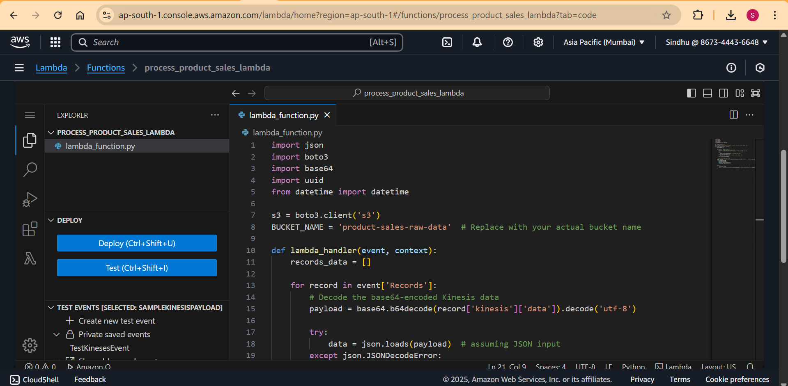
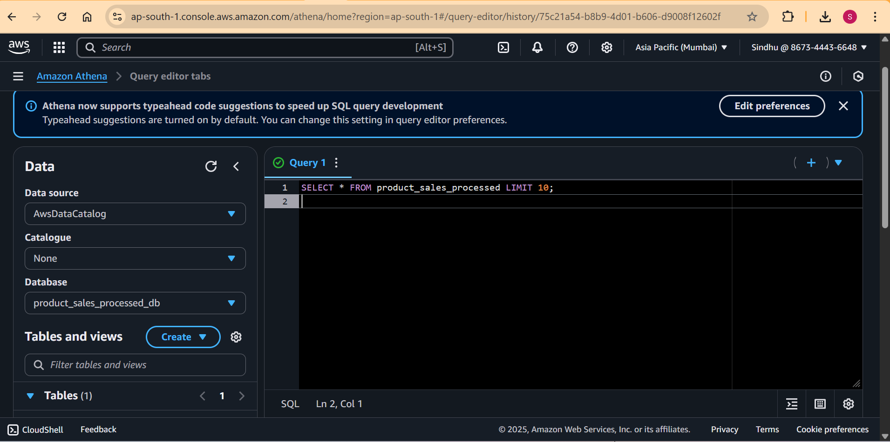
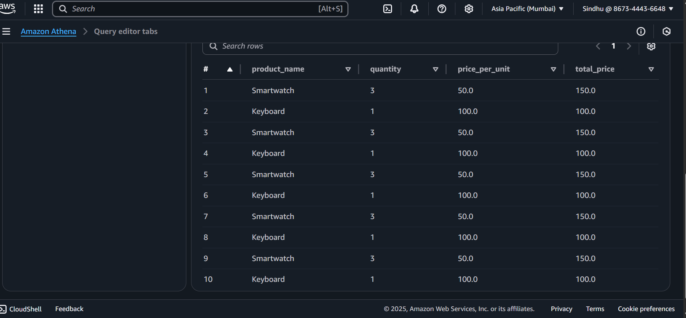
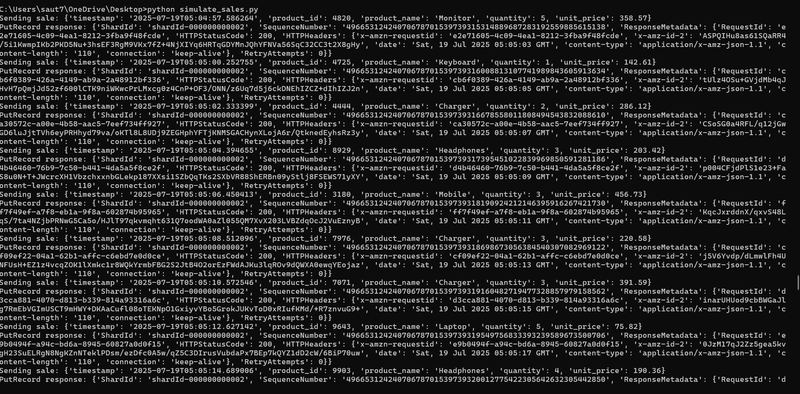
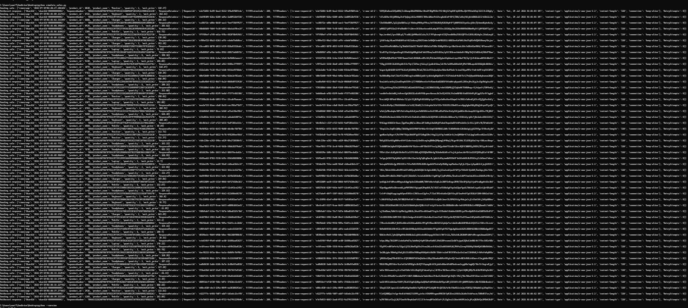

# 📊 Real-Time Product Sales Analytics Pipeline

A complete real-time + batch data processing project using AWS services such as Kinesis, Lambda, Glue (PySpark), S3, Athena, and Redshift.

---

## 🚀 Project Goal

To simulate a real-time analytics pipeline that:

- Streams live sales data using AWS Kinesis.
- Processes it using Lambda and AWS Glue (PySpark).
- Stores data in S3 (raw + processed).
- Queries processed data via Athena / Redshift.

---

## 📌 Architecture



---

## 🛠️ Tech Stack

| Component  | Purpose                    |
|------------|----------------------------|
| `Python`   | Data generator and Lambda  |
| `Kinesis`  | Real-time ingestion        |
| `Lambda`   | Stream transformation      |
| `AWS Glue` | ETL using PySpark          |
| `S3`       | Data lake                  |
| `Athena`   | SQL analytics              |
| `Redshift` | Optional warehouse         |

---

## 📂 Folder Structure

```

.
├── data/
│   └── sample\_data.json            # Sample sales events
├── lambda/
│   └── stream\_processor.py         # Lambda handler for Kinesis stream
├── glue/
│   └── etl\_script.py               # Glue job script (PySpark)
├── simulate\_sales.py              # Python script to simulate streaming
├── Screenshots/                   # Project screenshots
│   ├── Architecture.png
│   ├── s3-screenshot.png
│   ├── Lambda1.png
│   ├── Glue1.png
│   ├── Glue-tables.png
│   ├── Function-ss.png
│   ├── Athena1.png
│   ├── Athena2.png
│   ├── PythonData-ss.png
│   └── Python-Raw-Data.png
└── README.md

````

---

## ⚙️ Setup Instructions

### 1. Start Kinesis Stream

- Create a stream named `sales-stream`.

### 2. Deploy Lambda Function

- Runtime: Python 3.10  
- Trigger: Kinesis stream  
- Logic: Validate and push to raw S3

### 3. Run Producer Script

```bash
python simulate_sales.py
````

### 4. Configure AWS Glue

* **Source**: raw S3
* **Destination**: processed S3
* **Format**: Parquet or CSV

### 5. Query with Athena

* Connect to `processed/` folder
* Example SQL:

```sql
SELECT product_id, SUM(quantity) AS total_sales
FROM sales_data
GROUP BY product_id;
```

---

## 📷 Visual Project Screenshots

| Description                 | Screenshot                               |
| --------------------------- | ---------------------------------------- |
| 🟠 Raw Data in S3           |     |
| 🟢 Lambda Kinesis Trigger   |        |
| 🔵 Glue Job Script          |            |
| 📘 Glue Table Output        |    |
| 🧮 Lambda Function Console  |      |
| 📊 Athena Table View        |       |
| 📈 Athena Query Result      |       |
| 🐍 Python Generator Output  |      |
| 📦 JSON Sample Stream Input |  |

---

## 🧠 Learnings

* Real-time ingestion with Kinesis
* Data lake formation with S3
* Transformations with PySpark on Glue
* SQL analytics on semi-structured data with Athena

---

## 📝 License

MIT License

---

## 🙋‍♂️ Author

**Sai Sindhu Subbisetty**
GitHub: [SaiSindhuSubbisetty](https://github.com/SaiSindhuSubbisetty)


